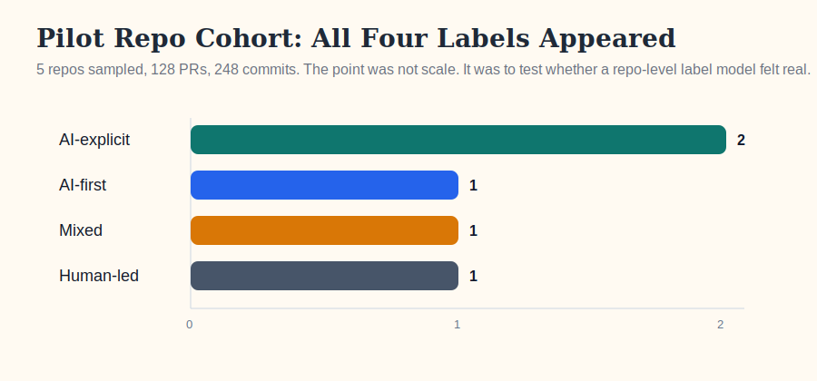
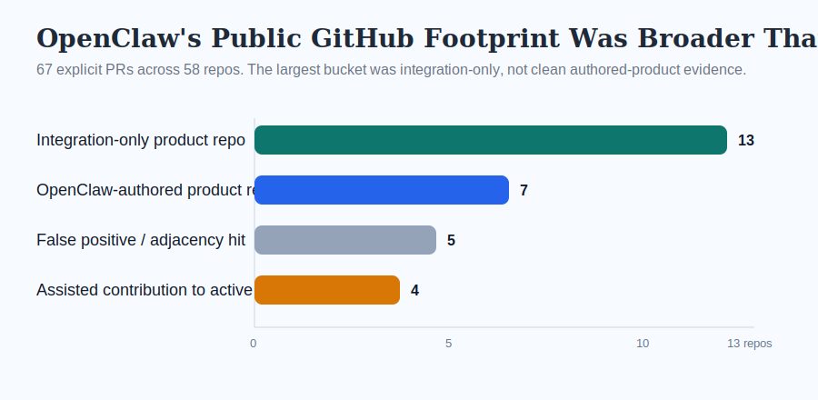
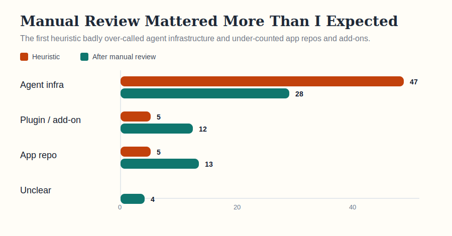
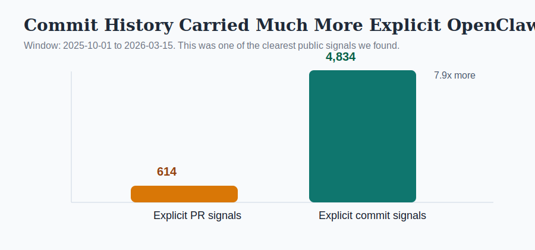

# What Public GitHub Can Actually Tell Us About AI-Built Software

Over the last few days, I ran a simple experiment inside a small repo called GHPR.

The question was straightforward:

Can public GitHub data tell us anything useful about human code versus AI code without pretending we can prove a clean binary?

I think the answer is yes, but only if we stop asking the wrong question.

The wrong question is:

> Is this repo AI or human?

The better question is:

> What visible evidence layers does this repo carry, and what do those layers suggest about authorship, assistance, and tooling?

That shift turned out to matter a lot.

## The Label Set That Started Working

Instead of treating authorship as a binary, I started using five repo-level labels:

- `AI-explicit`
- `AI-first`
- `mixed`
- `human-led`
- `unknown`

Then I tested whether those labels felt real on a tiny pilot cohort by combining README claims, PR attribution, commit metadata, manifest files, and workflow/config clues.

Even with just five repos, all four non-unknown labels showed up. That was encouraging because it suggested the label set was not just theoretical. It also hinted that public repos often carry layered evidence rather than one clean signal.

## Why OpenClaw Became The Best Stress Test

OpenClaw was interesting because it sits right on the edge of several categories at once.

It shows up as:

- a personal agent
- an orchestration layer
- a coding-adjacent platform
- a public GitHub ecosystem
- a media phenomenon

That makes it a useful case study for a harder question:

When people say an agent is "building apps," what does that actually look like in public artifacts?

I pulled explicit OpenClaw-attributed PR samples and tried to sort the product-shaped repos into four buckets:

- `OpenClaw-authored product repo`
- `OpenClaw-assisted contribution to active product repo`
- `OpenClaw integration-only product repo`
- `False positive / adjacency hit`

The result was one of the most important findings from the whole exploration:

The largest visible bucket was not clean authored-product evidence. It was integration-only.

In other words, OpenClaw is absolutely showing up around software, but the public GitHub trail is more often "this repo integrates with OpenClaw" or "this product touched OpenClaw" than "this repo is a clean, famous OpenClaw-built app."

That pushed me away from a hype-driven narrative and toward a more grounded one.

## Manual Review Changed The Story

The first heuristic pass over the OpenClaw sample overcalled infrastructure and undercounted actual products.

Once I manually reviewed the ambiguous repos, the distribution shifted a lot.

Before manual review, the sample looked overwhelmingly infrastructure-heavy.

After review, the ecosystem still leaned infrastructure-first, but it had a much more meaningful `app repo` and `plugin/add-on` layer than the heuristic suggested.

That was a useful reminder: if you want to study AI-authored software seriously, you cannot fully automate the interpretation layer too early.

The classifier can narrow the field.

A human still needs to resolve the mixed cases.

## PR Text Was Not The Best Attribution Surface

One of the cleaner quantitative signals came from comparing explicit PR-language matches against explicit commit-language matches in the same OpenClaw time window.

This surprised me.

Explicit commit-level signals were far richer than explicit PR-level signals.

That matters because a lot of public analysis focuses on PR descriptions, issue threads, or README text. But if AI provenance is surviving into pushed git history more often than PR bodies, then commit history may be one of the strongest public evidence layers we have.

## The Bigger Insight

After looking at repos, PRs, commits, curated tool lists, and the broader OpenClaw media narrative, I think the story is this:

Public GitHub can support a useful repo-level analysis of AI-built software, but only if we treat evidence as layered and probabilistic.

The strongest layers are:

- explicit provenance in README, PRs, and commit messages
- account and branch identity signals
- manifest and workflow files
- repo history shape
- only then code style

And just as important:

not every agent ecosystem leaves the same trace.

An app builder, a terminal agent, an IDE assistant, and an orchestration platform do not create the same public breadcrumbs.

That means the classifier should not look for one universal "AI smell."

It should look for different evidence regimes.

## The Story I Would Tell From This Exploration

If I had to compress the whole experiment into one conclusion, it would be this:

We are probably underestimating how much public GitHub can tell us about AI-built software, and overestimating how often it can tell us a clean yes-or-no story.

The interesting future is not a perfect detector.

It is a repo-level evidence model that can say:

- this repo is `AI-explicit`
- this repo is `mixed`
- this repo is `human-led`
- this repo has strong orchestration signals
- this repo has explicit commit attribution
- this repo looks more integrated than authored

That is a much more useful output than a brittle binary.

And honestly, it is a more truthful one too.

## Data Sources Behind The Charts

- Repo-level pilot cohort: [repo-authorship-signal-explorer.json](../output/repo-authorship-signal-explorer.json)
- OpenClaw explicit PR landscape: [openclaw-two-bucket-landscape.json](../output/openclaw-two-bucket-landscape.json)
- OpenClaw manual review note: [experiment-variation-openclaw-window-manual-review.md](./experiment-variation-openclaw-window-manual-review.md)
- OpenClaw smoke test: [openclaw-github-smoke.json](../output/openclaw-github-smoke.json)
